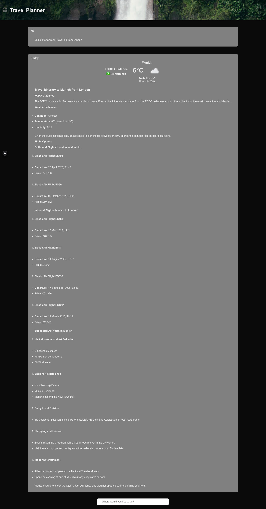

# Observable Travel Planner AI Agent

Example Travel Planner Application Showing how to observe AI agents using OpenLit. Built Using AI SDK by Vercel and Elasticsearch. Features in the talk [Observing AI Applications with OpenLit and OpenTelemetry](https://ndcmanchester.com/agenda/observing-ai-applications-with-openlit-and-opentelemetry-09c6/0uxqszkow87).



The application comprises several elements including:

1. A [Next.js](https://nextjs.org/) web application
2. AI connectivity leveraging [AI SDK](https://ai-sdk.dev/) to call both the LLM and connected tools
3. Local LLM hosting using [Ollama](https://ollama.com/)
4. Data layers, including:
   1.  Flight data in [Elasticsearch](https://www.elastic.co/elasticsearch)
   2.  Weather data originating from [Weather API](https://www.weatherapi.com/)
   3.  FCDO data captured via REST calls to the [GOV.UK API](https://content-api.publishing.service.gov.uk/reference.html#gov-uk-content-api)

The full architecture is depicted below:


## Prerequisites

To run this example, please ensure prerequisites listed in the repository [README](https://github.com/carlyrichmond/travel-planner-ai-agent) are performed:

1. Please ensure you have the following tools installed:
- Node.js
- npm

To check you have Node.js and npm installed, run the following commands:

```zsh
node -v
npm -v
```

*Please ensure that you are running Node v20.13.1 or higher*

2. Install [Ollama](https://ollama.com/) and pull the [`qwen3:8b` model](https://ollama.com/library/qwen3) locally.

3. Create an account and API key for the [Weather API](https://www.weatherapi.com/). Optionally, you can substitute your own weather data in [`weatherTool`](./src/app/ai/weather.tool.ts).

## Install & Run

Pull the required code from the accompanying content repository and start the project:

```zsh
git clone https://github.com/carlyrichmond/observing-ai-agents.git
```

Populate the `.env` file with your OpenAI key, Weather API key, Elasticsearch endpoint and Elasticsearch API key as per the below example, also available in [.example-env](.example-env):

```zsh
OPENAI_API_KEY=ARandomOpenAIKey?
WEATHER_API_KEY=MyWeatherKey!
ELASTIC_ENDPOINT=https://my-random-elastic-deployment:123
ELASTIC_API_KEY=ARandomKey!
```

Once these keys have been populated, you can use [`direnv`](https://direnv.net/) or an equivalent tool to load them. Note that `.env` file detection requires explicit configuration using the [`load_dotenv` option](https://direnv.net/man/direnv.toml.1.html#codeloaddotenvcode) as covered [here](https://dev.to/charlesloder/tidbit-get-direnv-to-use-env-5fkn).

Load the sample flight data using [`tsx`](https://www.npmjs.com/package/tsx) or [`ts-node`](https://www.npmjs.com/package/ts-node):

```zsh
direnv allow
cd src/app/scripts
npx tsx ingestion.ts
```

Initialize and start the application:

Ensure that the OTEL collector is running in a different terminal window:

```zsh
cd src/infra
docker compose up
```

Then you can start the chatbot using the below commands:

```zsh
npm install # key dependencies: ai ollama-ai-provider-v2 zod @elastic/elasticsearch openlit
npm run dev
```