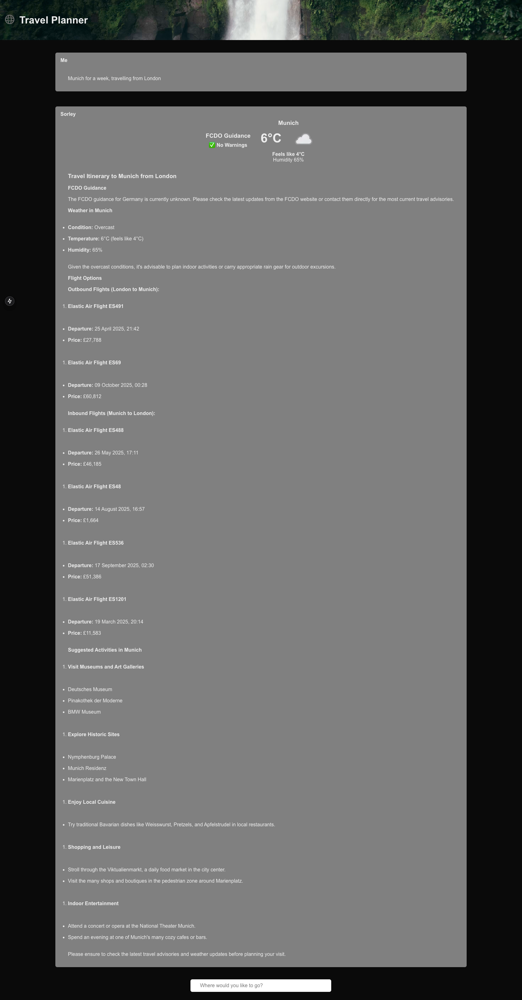

# Observable Travel Planner AI Agent

Example Travel Planner Application Showing how to observe AI agents using OpenLit. Built Using AI SDK by Vercel and Elasticsearch. Features in the talk [Observing AI Applications with OpenLit and OpenTelemetry](https://ndcmanchester.com/agenda/observing-ai-applications-with-openlit-and-opentelemetry-09c6/0uxqszkow87).



The application comprises several elements including:

1. A [Next.js](https://nextjs.org/) web application
2. AI connectivity leveraging [AI SDK](https://ai-sdk.dev/) to call both the LLM and connected tools
3. Azure OpenAI as the LLM provider (GPT-4o)
4. Data layers, including:
   1.  Flight data in [Elasticsearch](https://www.elastic.co/elasticsearch)
   2.  Weather data originating from [Weather API](https://www.weatherapi.com/)
   3.  FCDO data captured via REST calls to the [GOV.UK API](https://content-api.publishing.service.gov.uk/reference.html#gov-uk-content-api)

The observability infrastructure uses a **single OTel Collector Contrib** instance that fans out to two backends:

- **Elastic** — primary trace/log/metrics backend, used for the Tracing demo beat.
- **ClickHouse** — feeds the OpenLIT UI (Traces view, model/token breakdowns). Cost dashboards in OpenLIT will show zero because `@ai-sdk/otel` emits no `gen_ai.usage.cost` attribute; Elastic is the authoritative backend for the talk.

The full architecture is depicted below:


## Prerequisites

To run this example, please ensure prerequisites listed in the repository [README](https://github.com/carlyrichmond/travel-planner-ai-agent) are performed:

1. Please ensure you have the following tools installed:
- Node.js v22 or higher
- npm
- [Docker Desktop](https://www.docker.com/products/docker-desktop/) (required for the OTel collector and OpenLIT server)

To check you have Node.js and npm installed, run the following commands:

```zsh
node -v
npm -v
```

*Please ensure that you are running Node v22 or higher*

2. Create an Azure OpenAI deployment and note your resource name and API key. The deployment must be named **`gpt-4o`** — this is both what the app calls and what the OpenLIT eval judge selects by model name.

3. Create an account and API key for the [Weather API](https://www.weatherapi.com/). Optionally, you can substitute your own weather data in [`weatherTool`](./src/app/ai/weather.tool.ts).

## Install & Run

Pull the required code from the accompanying content repository and start the project:

```zsh
git clone https://github.com/carlyrichmond/observing-ai-agents.git
```

Populate the `.env` file with the values below as per the below example, also available in [.example-env](.example-env):

```zsh
AZURE_OPENAI_RESOURCE_NAME=my-azure-resource
OPENAI_API_KEY=ARandomOpenAIKey?
OPENAI_ENDPOINT=https://my-azure-resource.openai.azure.com/openai/v1/
WEATHER_API_KEY=MyWeatherKey!
ELASTIC_ENDPOINT=https://my-random-elastic-deployment:123
ELASTIC_API_KEY=ARandomKey!
PROXY_ENDPOINT=http://localhost:8123
OTEL_EXPORTER_OTLP_ENDPOINT=https://my-elastic-otel-deployment:443
OTEL_EXPORTER_OTLP_ENDPOINT_API_KEY=AnotherRandomKey!
OPENLIT_URL=http://localhost:3001
OPENLIT_API_KEY=openlit-...   # generated in the OpenLIT UI — see below
```

Once these keys have been populated, you can use [`direnv`](https://direnv.net/) or an equivalent tool to load them. Note that `.env` file detection requires explicit configuration using the [`load_dotenv` option](https://direnv.net/man/direnv.toml.1.html#codeloaddotenvcode) as covered [here](https://dev.to/charlesloder/tidbit-get-direnv-to-use-env-5fkn).

Load the sample flight data using [`tsx`](https://www.npmjs.com/package/tsx) or [`ts-node`](https://www.npmjs.com/package/ts-node):

```zsh
direnv allow
cd src/app/scripts
npx tsx ingestion.ts
```

Initialize and start the application:

Ensure that the OTEL collector, OpenLIT server, and ClickHouse are running in a different terminal window. The first run will pull images (allow a few minutes):

```zsh
cd src/infra
docker compose up
```

Once both `clickhouse` and `openlit` report `(healthy)` in `docker compose ps`, complete the one-time OpenLIT setup below, then start the app:

```zsh
npm install
npm run dev
```

## OpenLIT one-time setup

This is required for the evals demo beat. State is split across two Docker volumes:
- **`infra_openlit-data`** — SQLite: login, API keys, eval config. Survives `docker compose down`.
- **`infra_clickhouse-data`** — ClickHouse: Vault secret, provider catalog, eval results. Survives `docker compose down`.

Both are destroyed by `docker compose down -v` — after which every step below must be redone. If you only need to reset ClickHouse (e.g. after a schema change), use `docker volume rm infra_clickhouse-data` instead, which preserves OpenLIT's SQLite state.

1. Open `http://localhost:3001` and log in with `user@openlit.io` / `openlituser`.
2. **Vault** → New Secret → paste your Azure OpenAI API key → Save.
3. **Evaluations → Configuration** → set:
   - Provider: **OpenAI** *(not Azure OpenAI — it is not supported as a judge provider)*
   - Model: `gpt-4o` *(must match your Azure deployment name exactly)*
   - API Key: the Vault secret you just created
   → Create Config.
4. **Evaluations → Evaluators** → confirm Hallucination, Bias, and Toxicity are enabled.
5. **Settings → API Keys** → Generate → copy the `openlit-…` value into `OPENLIT_API_KEY` in your `.env`.

> **Why OpenAI and not Azure OpenAI?** OpenLIT's judge runs through a hardcoded provider switch that has no Azure case. Selecting Azure falls back to all-zero scores. Setting `OPENAI_BASE_URL` on the container (which compose does via `OPENAI_ENDPOINT`) redirects the OpenAI path at Azure's v1 API surface, which accepts the same bearer-token auth and implements the Responses endpoint that `@ai-sdk/openai` v3 uses.

> **OpenLIT Traces view.** Once the stack is running, `http://localhost:3001` → Requests/Traces will populate from the same OTel Collector that feeds Elastic. Provider, model, and token charts work. Cost dashboards show zero — `@ai-sdk/otel` emits no cost attribute. Elastic is the authoritative backend for the talk; do not use OpenLIT's `/home` dashboard on stage.
